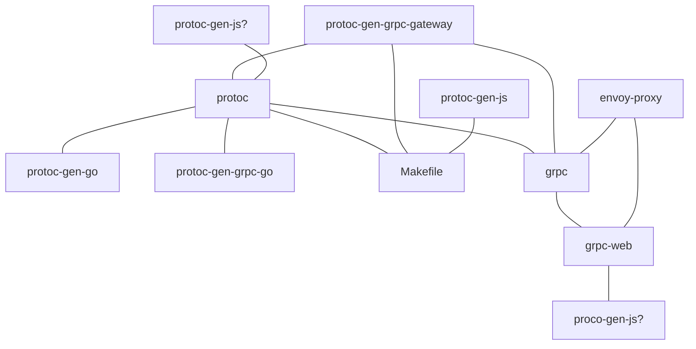

+++
title = "My presentation"
outputs = ["Reveal"]
+++

# grpc vs connect 

---

# grpc

---
# protoc-gen-js

---
# protoc-gen-js

- https://github.com/grpc/grpc-web/issues/704 which is a duplicate of
- https://github.com/protocolbuffers/protobuf-javascript/issues/105 which is a duplicate of
- https://github.com/protocolbuffers/protobuf-javascript/issues/127 and the issue is to

---
# protoc-gen-js


---

# solution


---

# protoc-gen-grpc-web
- Requires envoy proxy
- Get envoy proxy installed
- set up config, run envoy, points at grpc service

---

# protoc-gen-grpc-web
```
import { SayRequest, IntroduceRequest } from './gen/eliza_pb' import not found: IntroduceRequest
```

---
# protoc-gen-grpc-web


What about connect?

- let's get rid of protoc too
  - no Makefile
- let's used managed packages
  - no .proto files
  - no need for generated code
- no need for envoy
  - no envoy.yaml
  - no docker-comopose.yaml

---

# What do we get?

```diff
connect
- ├── envoy.yaml
- ├── docker-compose.yaml
- ├── Makefile
- ├── proto
- │   └── eliza.proto
├── backend
│   └── main.go
- │       └── pkg
- │           └── gen
- │               └── proto
- │                   └── elizav1
- │                       ├── eliza.pb.go
- │                       └── eliza_grpc.pb.go
└── frontend
    └── src
-         └── gen
-             ├── eliza_grpc_web_pb.js
-             ├── eliza_pb.d.ts
-             ├── eliza_pb.js
-             └── ElizaServiceClientPb.ts
```

# Where are the differences ?

```diff
- import { ElizaServiceClient } from './gen/ElizaServiceClientPb.js'
- import { SayRequest, IntroduceRequest } from './gen/eliza_pb'

+ import { ElizaService } from '@buf/bufbuild_eliza.bufbuild_connect-web/buf/connect/demo/eliza/v1/eliza_connectweb.js'
+ import { IntroduceRequest } from '@buf/bufbuild_eliza.bufbuild_es/buf/connect/demo/eliza/v1/eliza_pb.js'
```

--- 

# Where are the differences ?

```diff
- "github.com/joshcarp/grpc-vs-connect/grpc-web/backend/pkg/gen/proto/elizav1"
+ "buf.build/gen/go/bufbuild/eliza/bufbuild/connect-go/buf/connect/demo/eliza/v1/elizav1connect"
+ elizav1 "buf.build/gen/go/bufbuild/eliza/protocolbuffers/go/buf/connect/demo/eliza/v1"
```

---

# Where are the differences ?
```diff 
- # envoy.yaml
---
- admin:
-   access_log_path: "/tmp/admin_access.log"
-   address:
-     socket_address:
-       address: 0.0.0.0
-       port_value: 9901
- static_resources:
-   listeners:
-     - name: main-listener
-       address:
-         socket_address:
-           address: 0.0.0.0
-           port_value: 8082
-       filter_chains:
-         - filters:
-             - name: envoy.http_connection_manager
-               config:
-                 stat_prefix: ingress_http
-                 codec_type: AUTO
-                 route_config:
-                   name: local_route
-                   virtual_hosts:
-                     - name: local_service
-                       domains:
-                         - "*"
-                       routes:
-                         - match:
-                             prefix: "/buf.connect.demo.eliza.v1.ElizaService"
-                           route:
-                             cluster: ElizaService
-                             max_grpc_timeout: 0s
-                       cors:
-                         allow_origin_string_match:
-                           - prefix: "*"
-                         allow_methods: GET, PUT, DELETE, POST, OPTIONS
-                         allow_headers: keep-alive,user-agent,cache-control,content-type,content-transfer-encoding,grpc-status-details-bin,x-accept-content-transfer-encoding,x-accept-response-streaming,x-user-agent,x-grpc-web,grpc-timeout,authorization
-                         expose_headers: grpc-status-details-bin,grpc-status,grpc-message,authorization
-                         max_age: "1728000"
-                 http_filters:
-                   - name: envoy.grpc_web
-                   - name: envoy.cors
-                   - name: envoy.router

-   clusters:
-     - name: ElizaService
-       connect_timeout: 0.25s
-       type: logical_dns
-       http2_protocol_options: {}
-       lb_policy: round_robin
-       hosts:
-         - socket_address:
-             address: backend
-             port_value: 8081

```

--- 

# Where are the differences ?
```diff
- # Makefile
- proto:
- 	protoc -I./proto/ --go_out=paths=source_relative:backend/pkg/gen/proto/elizav1 eliza.proto
- 	protoc -I././proto/ --go-grpc_out=paths=source_relative:backend/pkg/gen/proto/elizav1 eliza.proto
- 	protoc -I././proto/ --js_out=import_style=commonjs:frontend/src/gen eliza.proto
- 	protoc -I././proto/ --grpc-web_out=import_style=typescript,,mode=grpcwebtext:frontend/src/gen eliza.proto
```


- grpc[]
- proto[]
- makefile[]
- then you search a little further, and find out that you can't use it in a browser
- desperate for a solution you start searching github and come across github.com/grpc/grpc-web
- with this solution the recommended solution is using an envoy proxy, so you spin up an envoy proxy[], envoy config[]
- the grpc-web implementation states that you need to use protoc-gen-js: 
- You try to install protoc-gen-js, but in the Issues and on the README you see that it's in a broken state, but it will be fixed by September 2022
- You see that in an issue the solution is to install an old version of protoc that still has protoc-gen-js
- old version of protoc[]
- protoc-gen-grpc-web[]
- After this ends you spend a little time figuring out which version of protoc can work with which version of grpc-web
```bash
import { LoginRequest } from '../protos/login_pb'; 
```
- this takes way too long

Once this is completed you can finally run your react app, but then you get another error that you've already come across, but turns out grpc-web's weird imports mean that it doesn't work properly with a `Vite+Typescript` app.

- so instead you change your app to use another serving framework
- 

---




--- 

Now we can finally run it

# What do we have
```diff
grpc
├── envoy.yaml
├── docker-compose.yaml
├── Makefile
├── proto
│   └── eliza.proto
├── backend
│   └── main.go
│       └── pkg
│           └── gen
│               └── proto
│                   └── elizav1
│                       ├── eliza.pb.go
│                       └── eliza_grpc.pb.go
└── frontend
    └── src
        └── gen
            ├── eliza_grpc_web_pb.js
            ├── eliza_pb.d.ts
            ├── eliza_pb.js
            └── ElizaServiceClientPb.ts
```
--- 

--- 


## What about the buf ecosystem?


- ~~protoc~~
- ~~Makefile~~ managed packages
- ~~grpc, grpc-web, protoc-gen-grpc-gateway~~ connect
- ~~envoy-proxy~~
- ~~protoc-gen-js + protoc-gen-grpc-web~~ protoc-gen-es, protoc-gen-connect-web

--- 

## What about the buf ecosystem?

```mermaid
graph TD;

```

--- 